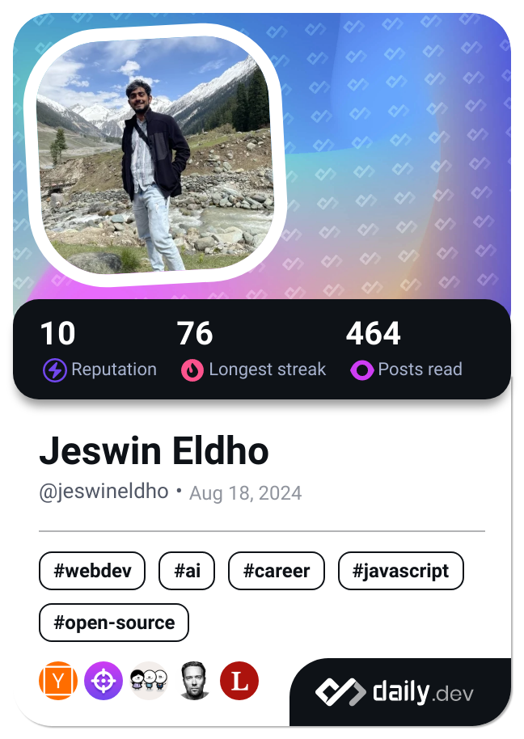

## 👋 Hey, I'm Jeswin

I'm a Full Stack Engineer with 5 years of experience building scalable, distributed systems. I’ve worked across fast-paced startups and growth-stage companies, shipping products that power API automation, AI integrations, and large-scale data workflows.

- 🔧 Tech I use: Go, React, TypeScript, Python, Docker, AWS, Kubernetes
- 🏗️ Major contributor in building and maintaining AP/O2C Automation product suite by Nanonets
- ⚙️ Love clean code, performance tuning, and infrastructure as code
- 🌐 Namespace: [jeswineldho.com](https://jeswineldho.com)

Let’s build cool stuff → [jeswineldho@gmail.com](mailto:jeswineldho@gmail.com)

Just my dev.to profile card. Looked cool to me 😛

